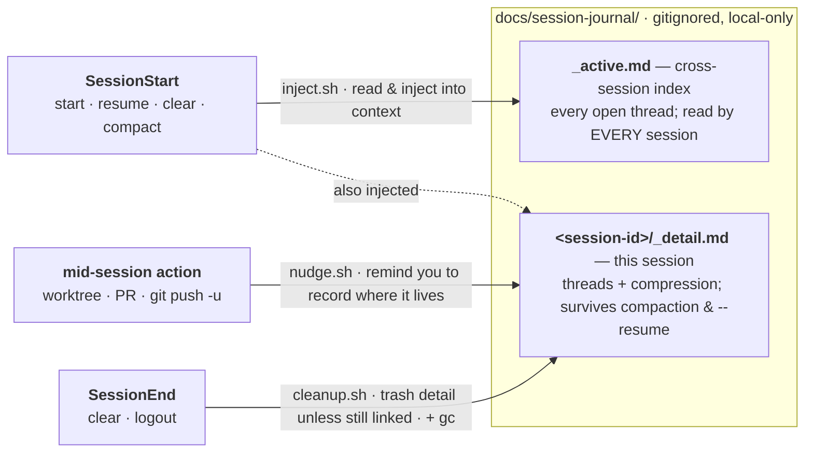

# session-journal-skill

A **cross-session task-state journal** for coding agents — a [Claude Code](https://docs.claude.com/en/docs/claude-code) skill + hooks that make your work state survive context compaction, `/clear`, and `--resume`.

It is deliberately small: three shell hooks, one script, one skill file. No dependencies beyond `bash`, `jq`, and `git`. Your journal is plain Markdown on disk, gitignored, and never leaves your machine.

---

## The problem it solves

Long agent sessions lose the thread. Specifically, **context compaction and `/clear` silently drop the load-bearing scaffolding** you need to keep working:

- *Which* tasks are in flight right now?
- **WHERE does each one live** — which worktree, which branch, which PR, which tracked issue?
- How do the threads relate (this one is blocked on that one)?
- What was decided, and **why**?

The harness auto-summary keeps the *gist of the conversation* but throws away exactly these facts. The classic failure: a session starts as a small bug fix in its own git worktree, drifts into planning a different feature after an auto-compaction, and the agent — no longer remembering which tree it is in — gets confused and nearly redoes shipped work.

The root cause is an **asymmetry**: reading state can be made deterministic (a hook injects it every session), but *writing* it usually relies on the model remembering to — which it doesn't, reliably. This skill closes both sides.

## How it works



*Reading is deterministic (a hook injects state every session); writing is nudged at the moments that matter. That symmetry is the whole idea.*

**Two tiers of plain-Markdown state under `docs/session-journal/` (gitignored):**

| File | Scope | Survives |
|---|---|---|
| `_active.md` | Cross-session index — every *unclosed* thread + a back-link | `/clear`, new sessions, everything |
| `<session-id>/_detail.md` | This session's full thread detail + a bounded conversation-compression block | This session's compactions + `--resume` |

**Three hooks make it deterministic:**

- **`SessionStart` → inject.** Every startup / resume / clear / compact, the index + this session's detail are injected straight into context. Reading is never left to chance. It even reads the current git branch and, when it *uniquely* matches a thread, banners "you are in *this* thread" — so a `/clear`'d worktree session resumes the right work without being told.
- **`PostToolUse` → nudge.** The single highest-value field is *where a thread lives*, and it is created mid-session — exactly when the SessionStart reminder has scrolled out of context. So a hook fires a one-shot, non-blocking reminder the moment you enter a worktree or run `gh pr create` / `git worktree add` / `git push -u`: *record where this lives now.* Writing stops being purely discretionary.
- **`SessionEnd` → cleanup.** On a terminal end (`/clear` / logout) the per-session detail file is trashed (recoverably) — **unless** an open thread still references it. The cross-session index always persists. Stale orphans are garbage-collected at session start, chain-aware (older members of a still-active session chain are kept).

Everything mechanical lives in one script, `journal.sh` (init / inject / cleanup / gc / list), so the hooks and the skill never drift.

## Install

The skill is self-contained — `SKILL.md`, `scripts/`, and `hooks/` all live under one directory, which lands at `<project>/.claude/skills/session-journal/`. Pick whichever adoption method you prefer; both produce the same layout.

### Method 1 — `install.sh` (copy)

```bash
git clone https://github.com/kai-tw/session-journal-skill.git
cd session-journal-skill
./install.sh /path/to/your/project      # omit the path to install into the current dir
```

The installer (1) copies the skill + bundled hooks → `<project>/.claude/skills/session-journal/`, (2) **non-destructively merges** the three hook registrations into `<project>/.claude/settings.json` (existing hooks preserved; re-running is idempotent), and (3) adds `docs/session-journal/` to `<project>/.gitignore`.

### Method 2 — git submodule (track upstream)

Mount this repo directly at the skill path, so the project pins a commit and pulls fixes with `git submodule update --remote`:

```bash
cd /path/to/your/project
git submodule add https://github.com/kai-tw/session-journal-skill .claude/skills/session-journal
.claude/skills/session-journal/install.sh --settings-only
```

A submodule brings **files only** — it cannot touch your `settings.json`. So `--settings-only` does steps (2) and (3) above (merge the hook registrations + gitignore) without copying anything.

Then restart your agent session so the `SessionStart` hook fires. **Requirements:** `bash`, `jq`, `git`. Tested on macOS and Linux.

> Prefer to wire it by hand? Copy the directory to `.claude/skills/session-journal/` and add the three hook entries (they point at `.claude/skills/session-journal/hooks/…`) from [`install.sh`](install.sh) to your `settings.json` yourself.

### Windows

The hooks are POSIX shell scripts, so on Windows use one of the two environments where bash is present:

- **WSL** — behaves exactly like Linux; everything works out of the box.
- **Git for Windows (Git Bash)** — Claude Code uses Git Bash by default to run shell hooks on native Windows, so `.sh` hooks and `$CLAUDE_PROJECT_DIR` work. Run `install.sh` from a Git Bash prompt.

Only native Windows with **no** Git Bash installed is unsupported — Claude Code then falls back to PowerShell, which cannot execute `.sh` hooks. Installing [Git for Windows](https://git-scm.com/downloads/win) resolves it. (The scripts are portable across BSD/macOS and GNU/Linux/MSYS `stat` and `trash`/`rm`, so no per-OS variant is needed.)

## Uninstall

```bash
./uninstall.sh /path/to/your/project
```

Removes the skill dir and strips the hook registrations from `settings.json`. If you added it as a submodule, `uninstall.sh` leaves the files in place and prints the `git submodule deinit` command to run instead. Either way it **does not** delete your `docs/session-journal/` contents — remove those yourself if you want them gone.

## What it is *not*

- **Not your issue tracker or plan DB.** It holds working state + pointers; link to your tracker (GitHub Issues / Linear / Jira / Notion / …), don't duplicate plan bodies here.
- **Not long-term memory.** Persistent preferences/corrections belong in your agent's memory system. This is task/thread working-state only.
- **Not a commit log.** Git owns history; the journal tracks *current* state and is updated in place.

## Privacy & data

The journal is **local-only and gitignored** — the installer adds the ignore rule for you, so your task notes (and anything sensitive you jot in them) stay out of version control. Deletion uses `trash` where available (recoverable) and falls back to `rm`. Nothing is sent anywhere; there is no network access in any script.

## Layout

The repo root **is** the skill — so it maps 1:1 onto `.claude/skills/session-journal/` in a consuming project (which is what makes the git-submodule method clean):

```
session-journal-skill/               →  <project>/.claude/skills/session-journal/
├── SKILL.md                     # the skill contract (when/how to write)
├── scripts/journal.sh           # all mechanical ops (init/inject/cleanup/gc/list)
├── hooks/
│   ├── session-journal-inject.sh    # SessionStart  → inject index + detail
│   ├── session-journal-cleanup.sh   # SessionEnd    → trash detail on terminal end
│   └── session-journal-nudge.sh     # PostToolUse   → nudge to record where a thread lives
├── install.sh · uninstall.sh    # adoption helpers (not needed for submodule files)
├── README.md · LICENSE
```

The hooks live **inside** the skill dir, so `settings.json` references them as `.claude/skills/session-journal/hooks/…` and the whole skill is one self-contained, submodule-mountable unit.

## License

MIT — see [LICENSE](LICENSE).
